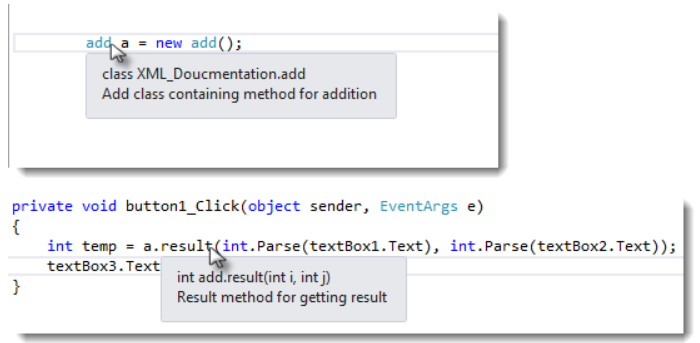

# C# Documentation by Lim Wei Zhen

Most the contents below are created with reference to "Complete C# Masterclass" from Udemy, created by Denis Panjuta.

If you are interested to learn more, click on the link below to visit the website.  

[Complete C# Masterclass](https://www.udemy.com/course/complete-csharp-masterclass/)
____

## **Introduction**

This is a C# documentation compiled by Lim Wei Zhen, which only covers the summary of codes, standard practices, and examples.

## **Section 1.0: Data Types and Variables**

### **Section 1.1: Integral**

There are different data types for integral (whole number), such as :

```cs
// range from -128 to 127
sbyte x = 120;

// range from -32,768 to 32,767
short x = 30000;

// range from -2,147,483,648 to 2,147,483,647
int x = 2000000;

// range from -9,223,372,036,854,775,808 to 9,223,372,036,854,775,807
long x = 9000000000;
```

**Tips & Suggestions :**

**Use the smallest data type your value fits into.**
____

### **Section 1.2: Float**

There are different data types for float (floating point value), such as :

```cs
// range from 1.5 x 10^-45 to 3.4 x 10^38, with 7-digit precision
float x = 99.99f; 
// Take note that "f" is added at the end of the numbers to tell C# that we are referring to float.

// range from 5.0 x 10^-324 to 1.7 x 10^308, 15-digit precision
double x = 15;

// range from -7.9 x 10^28 to 7.9 x 10^28, 28-digit precision
decimal x = 1.5m;
// Take note that "m" is added at the end of the numbers to tell C# that we are referring to decimal.
```

**Tips & Suggestions:**

**Depending on the performance :**

- **Use *`float`* if high demands for processing powers is required.**
- **Use *`double`* for real world values (except money calculations).**
- **Use *`decimal`* for high level of accuracy.**

____

### **Section 1.3: Boolean**

For boolean, it only allows for two statuses: **`true`**/**`false`**

```cs
bool switch = false;
```

____

### **Section 1.4: Unicode Characters And Strings**

There are different data types for strings, such as :

```cs
// for single character or unicode
char singleLetter = 'A';
// Take note that single quote allows for single character literal or unicode

// for string type data
string username = "WeiZhen123"
// Take note that when defining string data type, the "s" is lower case
```

____

### **Section 1.5: C# Standard Practice & Guidelines**

Maintaining code is not easy, especially when it is poorly written and hard to understand, hence it is always a good practice to :

- Create reasonable variable name.

```cs
// refer to user's age
int userAge = 35;
```

- Create proper method name.

```cs
// method to check internet connection
void CheckInternetConnection(){
    //fancy networking code
}
```

- Include comments.

There are multiple ways to include comments in C#, which are :

1. Single-Line Comments :
Any text between **`//`** and the end of the line is ignored by C# (will not be executed)

    ```cs
    // a bool to check if user is logged in
    bool isUserLoggedIn = true;
    ```

2. Multiline Comments :  
Any text between **`/*`** and **`*/`** will be ignored by C#.

    ```cs
    /* these methods are responsible
    for storing user data and connecting 
    to the database. */
    ```

3. XML Documentation Comments :  
Typing **`///`** before a class or function to create documentation automatically in Visual Studio. The documentation contains one or more documentation elements. Each element starts with a start tag (e.g. \<summary> )and ends with an end tag (e.g. \</summary>). The following is a list of a few elements with their description.

|**Element**|**Description**|
|---|---|
|\<summary>| Provide Description for Class, member and so on |
|\<param name="i">| Describe a parameter of a method |
|\<returns>| Describe return type of a method |
|\<value>| Describe value of a property |

```cs
/// <summary>
/// Add class containing method for addition
/// </summary>
class add
{
    /// <summary>
    /// Result method for getting result
    /// </summary>
    /// <param name="i"> First No. </param>
    /// <param name="j"> Second No. </param>
    /// <returns> returns int which is the sum of two No. </returns>
    public int result(int i, int j)
    {
        return i + j;
    }
}
```

Preview of XML Documentation Comments :


____

### **Section 1.6: C# Coding Conventions**

Coding conventions are important as they serve the following purposes:

- Create a consistent look to the code, so that readers can focus on content, not layout.
- Enable readers to understand the code more quickly by making assumptions based on previous experience.
- Facilitate copying, changing, and maintaining the code.
- Demonstrate C# best practices.

For a more in-depth explanations on the C# coding conventions, refer to the link below:

[C# Coding Conventions from learn.microsoft.com](https://learn.microsoft.com/en-us/dotnet/csharp/fundamentals/coding-style/coding-conventions#place-the-using-directives-outside-the-namespace-declaration)

[C# Coding Standards Best Practices from dofactory.com - Recommend](https://www.dofactory.com/csharp-coding-standards)
<br/>

### ***Naming Conventions***

To maintain consistency with Microsoft's .Net Framework, below are the common C# naming conventions and best practices. Use these in your own projects and/or adjust these to your own needs.
<br/>

#### **1. Class & Method**

Use **PascalCasing** for class names and method names.

```cs
public class ClientActivity
{
    public void ClearStatistics()
    {
        //...
    }
    public void CalculateStatistics()
    {
        //...
    }
}
```

**Why :** To be consistent with the Microsoft's .NET Framework and easy to read.
<br/>

#### **2. Variable & Method Arguments**

Use **camelCasing** for local variables and method arguments.

```cs
public class UserLog
{
    public void Add(LogEvent logEvent)
    {
        int itemCount = logEvent.Items.Count;
        // ...
    }
}
```

**Why :** To be consistent with the Microsoft's .NET Framework and easy to read.
<br/>

#### **3. Identifiers**

**Do not** use **`Hungarian`** notation or any other type identification in identifiers.

```cs
// Correct
int counter;
string name;

// Avoid
int iCounter;
string strName; 
```

**Why :** To be consistent with the Microsoft's .NET Framework. In addition, the Visual Studio IDE makes it very easy to determine the type of a variable (via tooltips). It is best to avoid type indicators in identifiers.
<br/>

#### **4. Constants**

**Do not** use Screaming Caps for constants or readonly variables.

```cs
// Correct
public static const string ShippingType = "DropShip";

// Avoid
public static const string SHIPPINGTYPE = "DropShip";
```

**Why :** To be consistent with the Microsoft's .NET Framework. Caps grap too much attention.
<br/>

#### **5. Abbreviations**

**Avoid** using **Abbreviations**.  
Exceptions : Commonly used abbreviations such as Id, Xml, Ftp, Uri.

```cs
// Correct
UserGroup userGroup;
Assignment employeeAssignment;
 
// Avoid
UserGroup usrGrp;
Assignment empAssignment;
 
// Exceptions
CustomerId customerId;
XmlDocument xmlDocument;
FtpHelper ftpHelper;
UriPart uriPart;
```

**Why :** To be consistent with the Microsoft's .NET Framework. It prevents inconsistent abbreviations by different developers.
<br/>

#### **6. Abbreviation Casing**

Do use **PascalCasing** for abbreviations 3 characters or more (2 chars are both uppercase).

```cs
HtmlHelper htmlHelper;
FtpTransfer ftpTransfer;
UIControl uiControl;
```

**Why :** To be consistent with the Microsoft's .NET Framework. Caps would grap visually too much attention.
<br/>

#### **7. No Underscores**

**Avoid** use **Underscores** in identifiers.  
Exception: Prefix private static variables with an underscore.

```cs
// Correct
public DateTime clientAppointment;
public TimeSpan timeLeft;

// Avoid
public DateTime client_Appointment;
public TimeSpan time_left;

// Exception
private DateTime _registrationDate;
```

**Why :** To be consistent with the Microsoft's .NET Framework. It makes code more natural to read (without 'slut). Also avoids underline stress, i.e. inability to see underline.
<br/>

#### **8. Type Names**

Do use **predefined type names** instead of system type names like Int16, Single, UInt64, etc.

```cs
// Correct
string firstName;
int lastIndex;
bool isSaved;

// Avoid 
String firstName;
Int32 lastIndex;
Boolean isSaved;
```

**Why :** To be consistent with the Microsoft's .NET Framework. It makes code more natural to read.
<br/>

#### **9. Implicit Types**

Do use implicit type **var** for local variable declarations.  
Exception: primitive types (int, string, doulbe, etc) use predefined names.

```cs
var stream = File.Create(path);
var customers = new Dictionary();

// Exceptions
int index = 100;
string timeSheet;
bool isCompleted;
```

**Why :** To removes clutter, particularly with complex generic types. Type is easily detected with Visual Studio tooltips.
<br/>

#### **10. Noun Class Names**

Do use noun or noun phrases to name a class.

```cs
public class Employee
{
}
public class DocumentCollection
{
}
```

**Why :** Consistent with the Microsoft's .NET Framework. Makes classes easy to remember.
<br/>

#### **11. Interface**

Do prefix interfaces with the letter **`I`**. Interface names are noun (phrases) or adjectives.

```cs
public interface IShape
{
}
public interface IShapeCollection
{
}
```

**Why :** To be consistent with the Microsoft's .NET Framework.
<br/>

#### **12. File Names**

Do name source file according to their main classes.  
Exception: File names with partial classess reflect their source or purpose, e.g. designer, generated, etc.

```cs
// Located in Task.cs
public partial class Task
{
    // ...
}

// Located in Task.generated.cs
public partial class Task
{
    // ...
} 
```

**Why :** To be consistent with the Microsoft practices. Files are alphabetically sorted and partial classess remain adjacent.
<br/>

#### **13. Namespaces**

Do organize namespaces with a clearly defined structure

```cs
// Examples
namespace Company.Product.Module.SubModule {}
namespace Product.Module.Component {}
namespace Product.Layer.Module.Group {}
```

**Why :** To be consistent with the Microsoft's .NET Framework. Maintains good organization of your code base.
<br/>

#### **14. Curly Brackets**

Do vertically align curly brackets.

```cs
// Correct
class Program
{
    static void Main(string[] args)
    {
    }
}
```

**Why :** Microsoft has a different standard, but developers have overwhelmingly preferred vertically aligned brackets.
<br/>

#### **15. Member Variables**

Do declare all member variables at the top of a class, with static variables at the very top.

```cs
// Correct
public class Account
{
    public static string BankName;
    public static decimal Reserves;

    public string Number {get; set;}
    public DateTime DateOpened {get; set;}
    public DateTime DateClosed {get; set;}
    public decimal Balance {get; set;}

    // Constructor
    public Account()
    {
        // ...
    }
}
```

**Why :** Generally accepted practice that prevents the need to hunt for variable declarations.
<br/>

#### **16. Enums**

Do use singular names for enums.  
Exception: bit field enums.

```cs
// Correct
public enum Color
{
    Red,
    Green,
    Blue,
    Yellow,
    Magenta,
    Cyan
}

// Exception
[Flags]
public enum Dockings
{
    None = 0,
    Top = 1,
    Right = 2,
    Bottom = 4,
    Left = 8
}
```

**Why :** To be consistent with the Microsoft's .NET Framework and makes the code more natural to read. Plural flags because enum can hold multiple values (using bitwise 'OR').
<br/>

#### **17. Enum Types**

**Do not** explicitly specify a type of an enum or values of enums (except bit fields)

```cs
// Don't
public enum Direction : long
{
    North = 1,
    East = 2,
    South = 3,
    West = 4
}
 
// Correct
public enum Direction
{
    North,
    East,
    South,
    West
}
```

**Why :** Create confusion when relying on actual types and values.
<br/>

#### **18. Enum Suffix**

**Do not** suffix enum names with Enum.

```cs
// Don't
public enum CoinEnum
{
    Penny,
    Nickel,
    Dime,
    Quarter,
    Dollar
}
 
// Correct
public enum Coin
{
    Penny,
    Nickel,
    Dime,
    Quarter,
    Dollar
}
```

**Why :** To be consistent with the Microsoft's .NET Framework and consistent with prior rule of no type indicators in indentifiers.
<br/>

### ***Layout Conventions***

Good layout uses formatting to emphasize the structure of your code and to make the code easier to read. Microsoft examples and samples conform to the following conventions :

- Use default Code Editor settings (smart indenting, four-character indents, tab saved as spaces).
- Write only one statement per line.
- Write only one declaration per line.
- If continuation lines are not indented automatically, ident them one tab stop (four spaces).
- Add at least one blank in between method definitions and property definations.
- Use parentheses to make clauses in an expression apparent, as shown in the following code.

```cs
if ((val1 > val2) && (val1 > val3))
{
    // Take appropriate action.
}
```

<br/>

### ***Place Using Directives Outside Namespace Declaration***

When a using directive is outside a namespace devlaration, that imported namespace is its fully qualified name. In addition to that, it is much more easier to use, read, and less prone to error.

```cs
using Azure;

namespace CoolStuff.AwesomeFeature
{
    public class Awesome
}
```

<br/>

### ***Commenting Conventions***

The common commenting conventions are :

- Place the comment on a separate line, not at the end of a line of code.
- Begin comment text with an uppercase letter.
- End comment text with a period.
- Insert one space between the comment delimiter (//) and the comment text, as shown in the following example.

```cs
// The following declaration creates a query. It does not run
// the query.
```

- Do not create formatted blocks of asterisks around comments.
- Ensure all public members have the necessary XML comments providing appropriate descriptions about their behavior.
<br/>

### ***Language Guidelines***

The following sections describe practices that the C# team follow to prepare code examples and samples.

#### **1. String Data Type**

Use [string interpolation](https://learn.microsoft.com/en-us/dotnet/csharp/language-reference/tokens/interpolated) to concatenate short strings, as shown in the following code.

```cs
string displayname = $"{nameList[n].LastName}, {nameList[n].FirstName}";
```

To append strings in loops, especially when you're working with large amounts of text, use a [StringBuilder](https://learn.microsoft.com/en-us/dotnet/api/system.text.stringbuilder?view=net-7.0) object.

```cs
var phrase = "lalalalalalalalalalalalalalalalalalalalalalalalalalalalalala";
var manyPhrases = new StringBuilder();
for (var i = 0; i < 10000; i++)
{
    manyPhrases.Append(phrase);
}
//Console.WriteLine("tra" + manyPhrases);
```

<br/>

#### **2. Arrays**

Use the concise syntax when you initialize arrays on the declaration line. In the following example, note that you can't use **`var`** instead of  **`string[]`**.

```cs
string[] vowels1 = {"a","e","i","o","u"};
```

If you use explicit instatiation, you can use **`var`**.

```cs
var vowels2 = new string[] {"a","e","i","o","u"};
```

<br/>

#### **3. `try-catch` And `using` Statements In Exception Handling**

Use a **`try-catch`** statement for most exception handling.

```cs
static string GetValueFromArray(string[] array, int index)
{
    try
    {
        return array[index];
    }
    catch (System.IndexOutOfRangeException ex)
    {
        Console.WriteLine("Index is out of range: {0}", index);
        throw;
    }
}
```

Simplify your code by using the C# [using statement](https://learn.microsoft.com/en-us/dotnet/csharp/language-reference/statements/using). If you have a [try-finally](https://learn.microsoft.com/en-us/dotnet/csharp/language-reference/keywords/try-finally) statement in which the only code in the finally block is a call to the [Dispose](https://learn.microsoft.com/en-us/dotnet/api/system.idisposable.dispose?view=net-7.0) method, use a **`using`** statement instead.  
In the following example, the **`try-finally`** statement only calls **`Dispose`** in the **`finally`** block.

```cs
Font font1 = new Font("Arial", 10.0f);
try
{
    byte charset = font1.GdiCharSet;
}
finally
{
    if (font1 != null)
    {
        ((IDisposable)font1).Dispose();
    }
}
```

You can do the same thing with a **`using`** statement.

```cs
using (Font font2 = new Font("Arial",10.0f))
{
    byte charset2 = font2.GdiCharSet;
}
```

Use the new [using syntax](https://learn.microsoft.com/en-us/dotnet/csharp/language-reference/statements/using) that doesn't require braces:

```cs
using Font font3 = new Font("Arial",10.0f)
byte charset3 = font3.GdiCharSet;
```

<br/>

#### **4. `&&` And `||` Operators**

To avoid exceptions and increase performance by skipping unnecessary comparisons, use **`&&`** instead of **`&`** and **`||`** instead of **`|`** when you perform comparisons, as shown in the following example.

```cs
Console.Write("Enter a dividend: ");
int dividend = Convert.ToInt32(Console.ReadLine());

Console.Write("Enter a divisor: ");
int divisor = Convert.ToInt32(Console.ReadLine());

if ((divisor != 0) && (dividend / divisor > 0))
{
    Console.WriteLine("Quotient: {0}", dividend / divisor);
}
else
{
    Console.WriteLine("Attempted division by 0 ends up here.");
}
```

<br/>

#### **5. `new` Operator**

Use one of the concise forms of object instantiation, as shown in the following declarations. The second example shows syntax that is available starting in C# 9.

```cs
var instance1 = new ExampleClass();
```

```cs
ExampleClass instance2 = new();
```

The preceding declarations are equivalent to the following declaration.

```cs
ExampleClass instance2 = new ExampleClass();
```

Use object initializers to simplify object creation, as shown in the following example.

```cs
var instance3 = new ExampleClass { Name = "Desktop", ID = 37414,
    Location = "Redmond", Age = 2.3 };
```

The following example sets the same properties as the preceding example but doesn't use initializers.

```cs
var instance4 = new ExampleClass();
instance4.Name = "Desktop";
instance4.ID = 37414;
instance4.Location = "Redmond";
instance4.Age = 2.3;
```

<br/>

#### **6. Event Handling**

If you're defining an event handler that you don't need to remove later, use a lambda expression.

```cs
public Form2()
{
    this.Click += (s, e) =>
        {
            MessageBox.Show(
                ((MouseEventArgs)e).Location.ToString());
        };
}
```

The lambda expression shortens the following traditional definition.

```cs
public Form1()
{
    this.Click += new EventHandler(Form1_Click);
}

void Form1_Click(object? sender, EventArgs e)
{
    MessageBox.Show(((MouseEventArgs)e).Location.ToString());
}
```

____

### **Section 1.7: Value Type And Reference Type**

In C#, data types are categorized based on how they store their value in the memory. C# includes the following categories of data types:

- Value type.
- Reference type.

### ***Value Type***

A data type is a value type if it holds a data value within its own memory space. It means the variable of these data types directly cotain values.

```cs
int i = 100;
```

The following data types are all of value type:

- bool
- byte/sbyte
- decimal/double/float/int/long/short
- char
- enum
- struct
- uimt
- ulong
- ushort

#### **Passing Value Type Variables**

When you pass a value type variable from one method to another, the system creates a separate copy of a variable in another method.

**If value got changed in the method, it wouldn't affect the variable in another method**.
<br/>
<br/>

### ***Reference Type***

Unlike value types, a reference type doesn't store its value directly. Instead, it stores the address where the value is being stored. In other words, a reference type contains a pointer to another memory location that holds the data.

```cs
string s = "Hello World!!";
```

The folloings are reference type data types:

- string
- Arrays (even if their elements are value types)
- Class
- Delegate

#### **Passing Reference Type Variables**

When you pass a reference type variable from one method to another, it doesn't create a new copy; instead, it passes the variable's address.

**If we change the value of a variable in a method, it will also be reflected in the calling method**.
____

### **Section 1.8: Implicit And Explicit Conversion**

The process of converting the value of one type (int, float, double, etc.) to another type is known as type conversion. In C#, there are two basic types of type conversion:

1. Implicit Type Conversions
2. Explicit Type Conversions

### ***Implicit Conversion***

In implicit type conversion, the C# complier automatically converts one type to another.  
Generally, smaller types like `int` (having less memory size) are automatically converted to larger types like `double` (having larger memory size).

```cs
int num = 1223456;
long bigNum = num;

float myFloat = 13.37;
double myNewDouble = myFloat;
```

### ***Explicit Conversion***

In explicit type conversion, we explicitly convert one type to another.  
Generally, larger types like `double` (having large memory size) are converted to smaller types like `int` (having small memory size).

```cs
double myDouble = 13.37;
int myInt;

myInt = (int)myDouble;
```

____

### **Section 1.9: C# Type Conversion using Convert Class**

In C#, we can use the `Convert` class to perform type conversion. The `Convert` class provides various methods to convert one type to another.

|Method|Description|
|---|---|
|`ToBoolean()`|Converts a type to a `Boolean` value|
|`ToChar()`|Covnerts a type to a `char` type|
|`ToDouble()`|Converts a type to a `double` type|
|`ToInt16()`|Converts a type to a 16-bit `int` type|
|`ToString()`|Converts a type to a `string`|

```cs
string myString = myDouble.ToString();
```

____

### **Section 1.10: C# Type Conversion using Parse()**

In C#, we can also use the `Parse()` method to perform type conversion.  
Generally, while performing type conversion between non-compatible types like `int` and `string`, we use `Parse()`.

```cs
string myString = "15";
string mySecondString = "13";
string result = myString + mySecondString;
// If .Parse() is not use, result = "1513"

int num1 = Int32.Parse(myString);
int num2 = Int32.Parse(mySecondString);
int resultInt = num1 + num2
// After .Parse() is use, resultInt = "28"
```

____

### **Section 1.11: String Manipulation**

There are different ways of manipulating string, and in this section, we are going to look at:

- String Concatenation
- String Formatting
- String Interpolation
- Verbatim Strings

Tips: Try to stick with one style throughout your project to maintain consistency.

For this section, the following variables will be used to explain the abovementioned methods of string manipulations.

```cs
// define few variables
int age = 31;
string name = "Alfonso";
string job = "Developer";
```

<br/>

### ***String Concatenation***

By using the `+` sign, we can concatenate the strings. Take note that in C#, the concatenation of strings also works with integers, which is different in other programming language.

```cs
Console.WriteLine("String Concatenation");
Console.WriteLine("Hello my name is " + name + ", I am " + age + "years old")
```

<br/>

### ***String Formatting***

The string are being concatenate using index. Take note that the index starts from 0, which is similar to some programming language.

```cs
Console.WriteLine("String Formatting");
Console.WriteLine("Hello my name is {0}, I am (1) years old. I'm a {2}", name, age, job);
```

<br/>

### ***String Interpolation***

String Interpolation uses `$` at the start which will allow us to write our variable in `{}`, which is similar to the `print(f'Text')` in Python.

```cs
Console.WriteLine("String Interpolation");
COnsole.WriteLine($"Hello my name is {name}, I am {age} years old");
```

I personally prefer this method of manipulating the string as it is more straightforward and neat.
<br/>
<br/>

### ***Verbatim Strings***

Verbatim strings start with `@` and tells the compiler to take the string literally and ignore any spaces and escape characters like `\n` (Line Break).

```cs
Console.WriteLine("Verbatim Strings");
Console.WriteLine(@"ABCDEFG.
ASFSAFASDASDSADASDASD. AdDSASDASDASD
 
 
ADSADASDSADAS ASDASDASD ADS ASD ASDA S DAD SADA.
ASDASDASD D ASDQW RFSA R WQ QWR WQR WQ RWQR,
REWQEQWEQWEQWEQWEQWE EASD SAD ASDS ADSA D");
```

However, verbatum strings is commonly used to write file paths. Instead of using `\\`, we can just add `@` at the beginning of the string. For example,

```cs
Console.WriteLine(@"C:\User\Admin\Desktop\Cool\CoolWallpaper.png");
```

Reference to the code block above, if we were to remove the `@`, we will get an error because \U, \A, \D and etc. are not valid escape characters.

Do take note that, verbatim strings will bypass valid escape characters. For example,

```cs
Console.WriteLine(@"Hahaha \n You have to work now!");
```

With reference to the code block above, the results printed on the console will ignore the escape character. Hence, line break will not appear in the result.
____

### **Section 1.12: String**

**String** is an object of the System.String class. In programming terms, string means sequence of characters.

However, there are some cases where you want to assign empty string to a variable. `string.Empty`, which is equivalent to `""`, is often used as it is considered to be more readable and can help to makle the code more self-documenting.

For example, you might use it when initializing a string variable or when checking whether a string is empty:

```cs
string myString = string.Empty;
if (myString == string.Empty)
{
    Console.WriteLine("The string is empty");
}
```

Using `string.Empty` instead of `""` can help to make the code more consistent and easier to read. It also avoids any confusion that might arise if you accidentally use two quotation marks instead of one.

It's worth noting that the string.Empty field is more efficient than using an empty string literal, as it is a static field and does not need to be allocated each time it is used. However, the performance difference is likely to be negligible in most cases, so you should use whichever form you find most readable and consistent with the rest of your code.
____

### **Section 1.13: String Functions**

**Functions** of the String class are used to manipulate and to perform various actions on given string.

In this section, we will only discuss some of the string **Functions** that is commonly used:

1. `SubString(int32)` - Used to get the SubString from the string, starting from the specified index.
2. `ToLower()` - Used to convert the string to lowercase.
3. `ToUpper()` - Used to convert the string to uppercase.
4. `Trim()` - Used to trim all leading and trailing white space from the string.
5. `IndexOf(string)` - Used to get the first occurrence of the string or character inside the string.
6. `IsNullOrWhiteSpace` - Returns true if the string is either null or is blank else it returns false.

Example of Program demonstrating string functions:

```cs
static void Main(string[] args){
    string firstName = "Denis";
    string lastName = "Panjuta";
    string fullName = string.Concat(" ",firstName,lastName," ");
    Console.WriteLine(firstName.Substring(2)); // output: "nis"
    Console.WriteLine(firstName.ToLower()); // output: "denis"
    Console.WriteLine(firstName.ToUpper()); // output: "DENIS"
    Console.WriteLine(fullName.Trim()): // output: "DennisPanjuta"
    Console.WriteLine(fullName.IndexOf('e')); // output: 1
    Console.WriteLine(String.IsNullOrWhiteSpace(firstName)); // output: false
}
```

Other than the functions mentioned above, there is also another functions that is commonly used and useful, which is the `String.Format` function.

In C#, `String.Format` method is used to insert the object or variable value inside any string. WIth the `String.Format`, we can replace the value in the specified format.

Syntax :

```cs
String.Format("any string {index}", object);
```

____

### **Section 1.14: Constant**

Constants are immutable values which are known at compile time and do not change for the life of the program.

```cs
const double PI = 3.14159265359;
```

____

## **Section 2.0: Functions/Methods**

### **Section 2.1: Methods**

A method is a code block that contains a series of statements. A program causes the statements to be executed by calling the method and specifying any required method arguments.

In C#, every executed instruction is performed in the context of a method. The Main method is the entry point for every C# application and it is called by the common language runtime (CLR) when the program is started.  

To create a method, the syntax shall be having the following framework:

```cs
<Access Specifier><Return Type><Method Name>(Parameter List)
{
    Method Body 
}
```

The meaning of each syntax is as following:

- `Access Specifier` : Determine the visibility of a variable or a method from another class.
- `Return Type` : A method may return a value. The return type is the data type of the value the method returns. If the method is not returning any values, then the return type is void.
- `Method Name` : Method name is a unique identifier and it is case sensitive. It cannot be same as any other identifier declared in the class.
- `Parameter List` : Enclosed between parentheses, the parameters are used to pass and receive data from a method. The parameter list refers to the type, order, and number of the parameters of a method. Parameters are optional; that is, a method may contain no parameters.
- `Method Body` : Contains the set of instructions needed to complete the required activity.

Example:

```cs
public int Add(int num1, int num2)
{
    int result = num1 + num2
    return result;
}
```

____

### **Section 2.2: Void Method**

`void` is used as the return type of a method (or a local function) to specify that the method doesn't return a value.

```cs
public static void Display(string myInput)
{

    Console.WriteLine(myInput);
}
```

`void` can also used as a referent type to declare a pointer to an unknown type. For more information, see [Pointer types](https://learn.microsoft.com/en-us/dotnet/csharp/language-reference/builtin-types/void).

However, do take note that `void` cannot be used as the type of variable.
____

### **Section 2.3: User Input**

In order to use get the user input, we can use `Console.ReadLine()`. For example :

```cs
    static void Main(string[] args)
    {
        string input = Console.ReadLine();
        Console.WriteLine(input);
        Console.Read();
    }
```

____

### **Section 2.4: Try, Catch And Finally**

A common usage of `catch` and `finally` together is to obtain and use resources in a `try` block, deal with exceptional circumstances in a `catch` block, and release the resources in the `finally` block.

For example :

```cs
static void Main(string[] args)
{
    Console.Write("Please enter a number!");
    string userInput = Consol.ReadLine();

    try // try something that might result in error
    {
        int userInputAsInt = int.Parse(userInput);
    }
    catch(FormatException) // run on specific error
    {
        Console.WriteLine("Format exception, please enter the correct type next time!");
    }
    catch(Exception) // run when encounter error
    {
        Console.WriteLine("General Exception");
    }
    
    Console.ReadKey();
}
```

However,  there are times where you do not know the exception, you can run `throw` within the `catch` statement so that error/exception will pop out.

For example :

```cs
static void Main(string[] args)
{
    Console.Write("Please enter a number!");
    string userInput = Consol.ReadLine();

    try // try something that might result in error
    {
        int userInputAsInt = int.Parse(userInput);
    }
    catch(Exception) // run when encounter error
    {
        throw;
    }
    
    Console.ReadKey();
}
```

Sometimes an exception may cause an error which ends the current method. However,that method might have opened a file or a network that needs to be closed. So, toi overcome such types of problem, C# provides a special keyword named as `finally` keyword.

The `finally` block will execute when the `try`/`catch` block leaves the execution, no matter what condition cause it. **It always executes whether the try block terminates normally or terminates due to an exception**. The main purpose of finally block is to release the system resources. The `finally` block follows `try`/`catch` block.

For example :

```cs
static void Main(string[] args)
{
    Console.Write("Please enter a numer!");
    string userInput = Consol.ReadlLine();

    try
    {
        int userInputAsInt = int.Parse(userInput);
    }
    catch(Exception) // run when encounter error
    {
        Console.WriteLine("General Exception");
    }
    finally // run after executing the try and catch argument
    {
        Console.WriteLine("This is called anyways!");
    }
    
    Console.ReadKey();
}
```

____

### **Section 2.5: Operators**

Opertators are used to perform operations on variables and values. The example code block below shows the commonly used operators in C# programming (exclusive of the basic mathematical operator and equality operators).

```cs
static void Main(string[] args)
{
    int num1 = 5;
    int num2 = 3;
    int num3;

    // unary operators
    num3 = -num1; // results : -5

    bool isSunny = true;
    bool isNotSunny = !isSunny // result : false
    
    // increment operators
    int num = 0;
    num++; // post increment
    ++num; // pre increment

    // decrement operators
    num--; // post decrement
    --num; // pre decrement

    // conditional operators
    bool isTrueAndFalse;
    bool isTrue = true;
    bool isFalse = false;
    // AND conditional operators (&&)
    isTrueAndFalse = isTrue && isFalse
    // OR conditional operators (||)
    isTrueAndFalse = isTrue || isFalse 
}
```

Note that string comparison is case-sensitive by default in C#. To perform a case-insensitive comparison, you can use the `String.Equals()` method with a `StringComparison.OrdinalIgnoreCase` parameter, like the example below.

```cs
string str1 = "hello";
string str2 = "HELLO";

if (String.Equals(str1, str2, StringComparison.OrdinalIgnoreCase))
{
    Console.WriteLine("str1 and str2 are equal (case-insensitive)");
}
else
{
    Console.WriteLine("str1 and str2 are not equal (case-insensitive)");
}
```

____

## **Section 3.0: Decision Making In C#**

### **Section 3.1: `if`, `else if`, `else` Statements**

In C#, the `if`, `else if`, and `else` statements are used to create conditional logic that executes different blocks of code depending on the evaluation of Boolean expressions.

The `if` statement is used to test a condition and execute a block of code if the condition is true.

For example :

```cs
int x = 10;
if (x > 5)
{
    Console.WriteLine("x is greater than 5");
}
```

The `else if` statement is used to add additional conditions to the `if` statement. If the first `if` statement condition is false, the program will evaluate the `else if` statement condition. If the `else if` statement condition is true, the code block associated with that condition will be executed.

For example :

```cs
int x = 10;
if (x > 5)
{
    Console.WriteLine("x is greater than 5");
}
else if (x == 5)
{
    Console.WriteLine("x is equal to 5");
}
```

The `else` statement is used to execute a block of code if none of the conditions in the `if` and `else if` statements are true. The `else` statement does not require a condition to evaluate.

For example :

```cs
int x = 10;
if (x > 5)
{
    Console.WriteLine("x is greater than 5");
}
else if (x == 5)
{
    Console.WriteLine("x is equal to 5");
}
else
{
    Console.WriteLine("x is less than 5");
}
```

____

### **Section 3.2: `TryParse()` Method**

In C#, the `TryParse()` method is a convenient way to parse a string representation of a numeric value into its corresponding data type (such as an `int` or `double`).

The `TryParse()` method is a member of the numeric data types, such as `int`, `double`, and `float`. The method takes two parameters: the string to be parsed, and an output parameter that receives the parsed value. The return value of the method is a Boolean that indicates whether the parse operation was successful.

The

```cs
bool result = [data type].TryParse(string s, out [data type] value);
```

For example :

```cs
string input = "42";
int output;

if (int.TryParse(input, out output))
{
    Console.WriteLine("The parsed value is " + output);
}
else
{
    Console.WriteLine("The input is not a valid integer");
}
```

In this example, the `int.TryParse()` method attempts to parse the string value "123" into an integer. If the parse operation is successful, the parsed value is stored in the `parsedValue` variable, and the `success`variable is set to `true`. If the parse operation fails, the `success` variable is set to `false`.

The `TryParse` method is commonly used in scenarios where user input needs to be converted to a data type, such as reading values from a file or database, or parsing input from a user interface. It can also be used to validate user input before performing calculations or other operations on the input data.
____

### **Section 3.3: `switch` Statement**

The `switch` statement is used to test a variable against a set of values and execute a block of code depending on which value matches. The syntax for the `switch` statement is as follows:

```cs
switch (variable)
{
    case value1:
        // Code to execute if variable equals value1
        break;
    case value2:
        // Code to execute if variable equals value2
        break;
    // More cases...
    default:
        // Code to execute if variable doesn't match any of the cases
        break;
}
```

For example :

```cs
char grade = 'B';
switch (grade)
{
    case 'A':
        Console.WriteLine("Excellent!");
        break;
    case 'B':
        Console.WriteLine("Well done");
        break;
    case 'C':
        Console.WriteLine("Good");
        break;
    case 'D':
        Console.WriteLine("Needs improvement");
        break;
    default:
        Console.WriteLine("Invalid grade");
        break;
}
```

In a 'switch`statement`, the `break` statement is used to exit the switch statement after the ccode block is executed.

The `default` case is code block that is executed when none of the other cases match the input value. The `default` case is optional and is used to provide a default action when none of the other cases match.

Note that the `default` case can appear anywhere in the `switch` statement, and it does not have to be the last case. However, conventionally it is placed at the end of the `switch` statement.
____

### **Section 3.4: Enhanced `if` Statements - Ternary Operator**

The ternary operator in C# is a shorthand way of writing an `if`-`else` statement. The ternary operator consists of three operands: a condition, a result for true, and a result for false. It is also known as the conditional operator.

The basic syntax of the ternary operator is as follows:

```cs
(condition) ? (result if true) : (result if false)
```

Here is an example of using the ternary operator to assign a value to a variable based on a condition:

```cs
int a = 5;
int b = 10;
int max = (a > b) ? a : b;

Console.WriteLine("The maximum value is " + max);
```

The ternary operator can be used anywhere that an expression is allowed, including assignments, method calls, and return statements. However, it is generally recommended to use the ternary operator only for simple expressions, and to use `if`-`else` statements for more complex logic to make the code more readable and maintainable.
____

## **Section 4.0: Loops And Loops Control**

Loops in C# are used to excutue a block of code repeatedly until a certain condition is met. There are three types of loops in C#, namely `for`, `while`, and `do-while`. Each loop type has its own syntax and use cases, which will be diccussed in this section.

### **Section 4.1: `for` Loops**

In C#, a `for` loop is a type of loop that is  used to execute a block of code for a fixed number of times. The syntax of a `for` loop is as follows:

```cs
for (initialization; condition; iteration)
{
    // code to execute
}
```

The `initialization` statement is executed once at the beginning of the loop. It is typically used to initialize a counter variable, although it can be any valid statement. The `condition` is evaluated at the beginning of each iteration, and if it is true, the code inside the loop is executed. After each iteration, the `iteration` statement is excuted.

Here's an example of using a `for` loop to iterate over an array of integers and print each value :

```cs
int[] numbers = { 1, 2, 3, 4, 5 };

for (int i = 0; i < numbers.Length; i++)
{
    Console.WriteLine(numbers[i]);
}
```

____

### **Section 4.2: `do while` Loop**

In C#, a `do while` loop is a type of loop that is used to execute a block of code at least once, and then repeat the execution as long as a specified condition is true. The syntax of a `do while` loop is as follows:

```cs
do
{
    // code to execute
} while (condition);
```

The `do` statement executes the code block at least once, regardless of whether the `condition` is true or false. After the code block is executed, the condition is evaluated. If the condition is true, the loop continues executing. If the condition is false, the loop exits.

Here's an example of using a `do while` loop to repeatedly prompt the user for input until they enter a valid number:

```cs
int number;

do
{
    Console.Write("Enter a number: ");
} while (!int.TryParse(Console.ReadLine(), out number));

Console.WriteLine("You entered: " + number);
```

____

### **Section 4.3: `while` Loop**

In C#, a `while` loop is a type of loop that is used to execute a block of code repeatedly as long as a specified condition is true. The syntax of a `while` loop is as follows:

```cs
while (condition)
{
    // code to execute
}
```

The `condition` is evaluated at the beginning of each iteration, and if it is true, the code inside the loop is executed. After the code inside the loop is executed, the `condition` is evaluated again. This process continues until the `condition` becomes false, at which point the loop exits.

Here's an example of using a `while` loop to repeatedly prompt the user for input until they enter a valid number:

```cs
int number;

while (!int.TryParse(Console.ReadLine(), out number))
{
    Console.Write("Enter a number: ");
}

Console.WriteLine("You entered: " + number);
```

____

### **Section 4.4: `break` And `continue`**

In C#, `break` and `continue` are two keywords that are used in loops to control the flow of execution.

`break` is used to exit the loop prematurely. When the `break` statement is executed, the control of the program is transferred to the next statement immediately after the loop. For example, consider the following code:

```cs
for (int i = 1; i <= 10; i++)
{
    if (i == 5)
    {
        break;
    }
    Console.WriteLine(i);
}
```

`continue` is used to skip over the current iteration of the loop and proceed to the next iteration. For example, consider the following code:

```cs
for (int i = 1; i <= 10; i++)
{
    if (i % 2 == 0)
    {
        continue;
    }
    Console.WriteLine(i);
}
```

____

## **Section 5.0: Object Oriented Programming (OOP)**

Object-oriented programming (OOP) is a programming paradigm that uses objects to represent real-world entities and the interactions between them. C# is a powerful object-oriented language that supports the four fundamental concepts of OOP :

1. Encapsulation.
2. Inheritance.
3. Polymorphism.
4. Abstraction.

Each fundamental concepts has its own function and usage, which will be further discussed in the following section.

### **Section 5.1: Classes**

In C#, a class is a blueprint or template for creating objects that share the same characteristics and behavior. A class defines a set of properties, methods, and events that describe the behavior of its objects. Here's an example of a simple class in C# :

```cs
public class Person
{
    // Fields (attributes)
    private string name;
    private int age;

    // Constructor
    public Person(string name, int age)
    {
        this.name = name;
        this.age = age;
    }

    // Properties
    public string Name
    {
        get { return name; }
        set { name = value; }
    }

    public int Age
    {
        get { return age; }
        set { age = value; }
    }

    // Methods
    public void SayHello()
    {
        Console.WriteLine("Hello, my name is " + name + " and I am " + age + " years old.");
    }
}
```

In this example, the `Person` class has two private fields (`name` and `age`) and two public properties (`Name` and `Age`). The `get` accessor of each property returns the value of the corresponding field, while the `set` accessor assigns a new value to the field.

To access a property of an object of this class, you would use dot notation:

```cs
Person person = new Person();
person.Name = "John";
person.Age = 30;
```

In this example, we create a new `Person` object and set its `Name` and `Age` properties to "John" and 30 respectively. Note that when you set a property, the corresponding `set` accessor is called and the new value is assigned to the corresponding field. Similarly, when you read a property, the corresponding `get` accessor is called and the value of the corresponding field is returned.
____

### **Section 5.2: Instance Variable And Local Variable**

In C#, an instance variable (also known as a member variable) is a variable that belongs to an instance of a class. It is declared inside the class, but outside any method, constructor, or property, and is used to store data that is associated with a particular object created from the class. Instance variables are initialized when an object of the class is created, and they retain their values as long as the object exists.

On the other hand, a local variable is a variable that is declared inside a method, constructor, or property of a class, and is used to store temporary data that is needed only within that method, constructor, or property. Local variables are created when the method, constructor, or property is called, and they are destroyed when the method, constructor, or property returns.

Here's an example to illustrate the difference between instance variables and local variables:

```cs
public class Person
{
    private string name; // instance variable

    public void SetName(string name) // method
    {
        string temp = name; // local variable
        this.name = temp;
    }
}
```

In this example, we have a `Person` class with an instance variable called `name`. We also have a method called `SetName` that takes a parameter called `name`, which is a local variable. inside the method, we assign the value of the local variable `name` to the instance variable `this.name`.

The main difference between instance variables and local variables is their scope and lifetime.

- Instance variables are visible and accessible throughout the class, and they retain their values as long as the object exists.

- Local variables are visible and accessible only within the method, constructor, or property when they are declared, and they are destroyed when the method, constructor, or property returns.

____

### **Section 5.3: `this` Keyword**

In C#, `this` is a keyword that refers to the current instance of the class. It is mainly used to differentiate between instance variables and local variables or parameters that have the same name.

Here's an example to illustrate how `this` is used:

```cs
public class Person
{
    private string name;
    private int age;

    public Person(string name, int age)
    {
        this.name = name;
        this.age = age;
    }

    public void Print()
    {
        Console.WriteLine("Name: " + this.name);
        Console.WriteLine("Age: " + this.age);
    }
}
```

By using `this` in this way, we can avoid naming conflicts between the instance variables and the parameters or local variables.

Additionally, `this` can be used to call other constructors in the same class. This is useful when you have multiple constructors with different parameters, but you want to avoid duplicating code.

Here's an example:

```cs
public class Person
{
    private string name;
    private int age;

    public Person()
        : this("Unknown", 0) 
    {
    }

    public Person(string name)
        : this(name, 0)
    {
    }

    public Person(int age)
        : this("Unknown", age)
    {
    }

    public Person(string name, int age)
    {
        this.name = name;
        this.age = age;
    }

    public void Print()
    {
        Console.WriteLine("Name: " + this.name);
        Console.WriteLine("Age: " + this.age);
    }
}
```

In this example, we have multiple constructors that call each other using `this`. The first constructor is the default constructor that calls the parameterized constructor with default values. The other constructors call the parameterized constrtuctor with different combinations of parameters.

This way, we can reuse the code in the parameterized constructor without duplicating it **(Only define two instance variables and use for all constructor)**.

____

### **Section 5.4: Constructor**

In C#, a constructor is a special method that is automatically called when an instance of a class is created. Its purpose is to initilaize the object's state and set its initial values.

There are several ways to create a constructor in a class, depending on your requirements. Here are some methods to create a constructor with explanations :

***1. Default Constructor***

The default constructor is a constructor that takes no arguments and is automatically created by the compiler if you do not define any other constructor. Its purpose is to initialize all fields to their default values.
Here is an example of a default constructor :

```cs
public class MyClass
{
    public int MyProperty { get; set; }
    
    public MyClass() // Not taking arguments
    {
        MyProperty = 0;
    }
}
```

***2. Parameterized Constructor***

A parameterized constructor is a constructor that takes one or more arguments to initialize the object's fields. You can define multiple parameterized constructors by changing the number of types of arguments.  
Here is an example of a parameterized constructor :

```cs
public class MyClass
{
    public int MyProperty { get; set; }
    
    public MyClass(int MyProperty) // Taking arguments by defining data type follow with the variable name
    {
        this.MyProperty = MyProperty;
    }
}
```

or

```cs
public class MyClass
{
    public int MyProperty { get; set; }
    
    public MyClass(int MyProperty string PropertyName) // Taking multiple arguments
    {
        this.MyProperty = MyProperty;
    }
}
```

Parameterized constructors are useful when you need to initialize an object with values that are not known at the time the object is created. They also provide a way to validate the parameters being passed in and ensure that the object is being initialized correctly.

***3. Copy Constructor***

A copy constructor is a constructor that takes an object of the same class and creates a new object with the same values as the original object.
Here is an example of a copy constructor :

```cs
public class MyClass
{
    public int MyProperty { get; set; }
    
    public MyClass(MyClass other) 
    {
        MyProperty = other.MyProperty;
    }
}
```

Copy constructor are useful when you need to create a new object that is a copy of an exisiting object, rather than just copying its reference.

Here are some situations where you might want to use a copy constructor:

- When you need to create a new object that has the same values as an exisitng object, but with some modifications. For example, you might want to create a new `Person` object that has the same name and age as an existing `Person`, but with a different address.
- When you need to create a new object that is a deep copy of an existing object. A deep copy is a copy of the object and all of its contetns. This is useful when the original object contains othe objects that need to be copied as well.
- When you want to create a new object that is immutable. An immutable object is an object that cannot be modified after it is created. A copy constructor can be used to create a new immutable object with the same values as the original object.

***4. Static Constructor***

A static constructor is a constructor that is called only once, when the calss is loaded into memory. Its purpose is to initialize static fields or perform other static initialization.  
Here is an example of a static constructor :

```cs
public class MyClass
{
    public static int MyStaticProperty { get; set; } // static constructor
    
    static MyClass()
    {
        MyStaticProperty = 0;
    }
}
```

***5. Chained Constructor***

A chained constructor is a constructor that calls another constructor in the same class using `this` keyword. This allows you to reuse initialization logic and avoid duplicating code.  
Here is an example of chained constructor :

```cs
public class MyClass
{
    public int MyProperty { get; set; }
    
    public MyClass(int myProperty) : this()
    {
        MyProperty = myProperty;
    }
}
```
